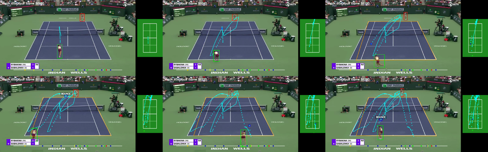

::::::: model-field-sheet
## Purpose

This started during the 2022 US Open. I was at a bar and was struck by how clean the camerawork was. During play, the camera barely moved: one lengthwise shot contained the court, both players and the ball. I figured tennis analytics must be booming because of this. A quick search suggested the opposite.

I tend to learn best by trying, and failing, to apply something new to a real problem. The goal here is to build a program which takes in the full broadcast of a tennis match and pushes out an account of it in tabular form: where the players and ball were, what happened and which point it belonged to.

## System

The object, court and scoreboard models read the same video separately. Their outputs are joined by frame, then reduced into events and points. The final product is three linked tables rather than another annotated video.

This is decidedly not Hawk-Eye. Here's the thing: it does not have to be. The standard depends on what the data are being used for, and whether the measurements are stable enough for that use.

## Contents

<nav class="model-contents model-contents-section" aria-label="Contents">

::: model-contents-links
<a href="#data">Data</a> <a href="#outputs">Outputs</a> <a href="#model">Model</a> <a href="#processing">Processing</a> <a href="#validation">Validation</a> <a href="#next-steps">Next steps</a>
:::

</nav>

## Data

The first modelling set sampled roughly 3,000 frames from quarter-final highlight videos at 15 tournaments. About 2,000 showed the standard gameplay camera. Only those frames were labelled for the front player, back player and ball. This introduced different courts, players, clothing and lighting without spending most of the labelling time on replays and crowd shots.

Event labels were added later. The current high-definition event set contains 1,560 labelled moments from 15 matches: 624 hits, 685 bounces, 110 serves, 14 net contacts and 127 dead-ball frames. Matches, rather than individual frames, are kept together during validation.

The input is one television feed. There is no calibrated camera, chipped ball or proprietary tracking feed.

## Outputs

The output is three tables, linked by match and frame.

::: model-parameter-table
|  |  |  |
|---:|:---:|:---|
| **Frame** | = | player and ball locations, court geometry, score readout and imputation flags |
| **Event** | = | serve, hit, bounce or net contact; frame, location, actor and point |
| **Point** | = | server, score state, start and end frames, and the events inside the point |
:::

Only six pieces of notation are needed below.

::: model-parameter-table
|  |  |  |
|---:|:---:|:---|
| $f$ | = | video frame |
| $\mathbf b_f$ | = | ball location in frame $f$ |
| $\mathbf p_f^{F},\mathbf p_f^{B}$ | = | front- and back-player locations |
| $H_f$ | = | transform from image pixels to a common court |
| $E_e$ | = | labelled frames for event type $e$ |
| $d_{f,e}$ | = | distance from frame $f$ to the nearest event of type $e$ |
:::

## Model

```{mermaid}
flowchart TB
  video["BROADCAST VIDEO"] --> objects["OBJECTS<br/>front player · back player · ball"]
  video --> court["COURT<br/>14 landmarks · homography"]
  video --> score["SCOREBUG<br/>point and game score"]

  objects --> frames["frame table<br/>locations · confidence · missingness"]
  court --> frames
  frames --> eventmodel["EVENT MODEL<br/>motion · geometry · frames to event"]
  eventmodel --> events["serve · hit · bounce · net"]
  score --> points["point windows"]
  events --> points
  points --> output["frame · event · point data"]

  class video,objects,court,score,eventmodel phase
```

### Objects

The current high-definition path uses RF-DETR to locate the front player, back player and ball. Earlier versions used YOLOv5; both write the same frame-level table. The front player is usually easy. The back player is smaller and often mixed in with the ball people. The ball is worse: it can look like a dot, a streak or nothing at all.

Missing locations remain missing in storage. Short gaps can be interpolated within a continuous piece of play, but each repaired value keeps an imputation flag so it is not confused with an observed detection later.

### Court

Once the court is located, its known dimensions make the perspective change almost free. The difficult part is locating it reliably. A TrackNet-style model estimates 14 court landmarks; valid landmarks define a projective transform $H_f$ from image pixels to a regulation court:

$$
\lambda
\begin{pmatrix}
u\\v\\1
\end{pmatrix}
=
H_f
\begin{pmatrix}
x\\y\\1
\end{pmatrix}.
$$

The camera normally holds still during a point. New estimates are checked for implausible jumps and rejected when they fail; in that case, the last good court is carried forward.

{fig-alt="Six frames from a rally with player and ball detections, court projection and the accumulating ball path." width="100%"}

### Events

An event label belongs to one frame, but the surrounding frames contain most of the useful information. Instead of classifying each frame as an event or non-event, the target for event type $e$ is its distance from the closest labelled event:

$$
d_{f,e}=\min_{g\in E_e}|f-g|.
$$

Separate XGBoost models predict this distance from player and ball positions, velocity, acceleration, direction changes, curvature, proximity to each player and missingness. Frames near an event receive more weight:

$$
w_{f,e}=\exp(-\alpha d_{f,e}),
\qquad \alpha=0.1.
$$

At inference, predicted distance is smoothed within each continuous sequence. Local minima below an event-specific threshold become the predicted events. Features, smoothing and event detection all stop at the sequence boundary.

## Processing

Object and court predictions are first reduced to one row per frame. The court table provides the full frame index, object locations are joined onto it, and short gaps are interpolated while retaining the imputation flags.

The scorebug is read every few frames using EasyOCR. A change in score anchors the end of a point, while the serve prediction helps locate its beginning. Events between those anchors are assigned to the point.

The first complete release processed a 132-minute, 720p broadcast in 129 minutes using a Colab T4 and a personal laptop. That timing belongs to the earlier pipeline, not the current detector stack, but it showed that a full match could be processed in roughly its broadcast length.

## Validation

Object coverage was checked on a separate, unseen first set. The front player was found in nearly every frame, while the back player and ball were found in about half. These are raw coverage rates before interpolation, not precision estimates.

| Object | Frame coverage |
|:--|--:|
| **Front player** | 97.5% |
| **Back player** | 43.5% |
| **Ball** | 50.0% |
| **All three** | 25.6% |

Event performance was evaluated with five-fold cross-validation, keeping whole matches together. Predicted events were matched one-to-one with labels and counted as correct within three frames.

| Event | Labels | Precision | Recall | F1 |
|:--|--:|--:|--:|--:|
| **Hit** | 624 | 0.719 | 0.721 | 0.720 |
| **Bounce** | 685 | 0.819 | 0.848 | 0.834 |
| **Serve** | 110 | 0.873 | 0.809 | 0.840 |
| **Net** | 14 | 0.000 | 0.000 | 0.000 |

The cross-validation table looks good. The fully unseen set was less tidy: 17 of 20 hits and 23 of 27 bounces were found within three frames, but only 2 of 8 serves and none of 4 net contacts. Precision was not estimated because unreviewed frames were not labelled as negatives.

Hits and bounces appear to travel to a new broadcast. Serve detection does not yet. The net row mostly says that 14 examples are not enough to fit or judge a useful model.

The projected court coordinates also failed their geometry audit. They remain useful for inspection, but they are excluded from the event models until they pass a dedicated test.

## Next steps

1.  Validate the court transform against hand-labelled landmarks and known court dimensions before using projected movement in a model.
2.  Rebuild serve detection around the serve sequence rather than treating it as another generic trajectory minimum.
3.  Add enough net contacts to decide whether they are learnable from broadcast video at all.
4.  Join reliable events to point outcomes, then estimate serve, return and shot-level value from the resulting sequences.

Return probability was the statistic I had in mind when the first match was released: given where and how a ball was struck, how often should it come back? With enough reliable point sequences, the same data can separate serve and return skill, describe shot difficulty and begin to answer that question.

The current implementation lives in the [`track` application](https://github.com/spazznolo/tennis/tree/main/apps/track).
:::::::
