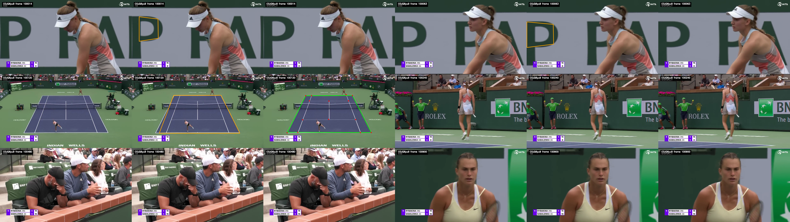

::::::: model-field-sheet
## Purpose

The idea began while watching the US Open at a bar. During play, the camera barely moved: one clean, lengthwise shot contained the court, both players and the ball. It seemed like tennis ought to be the easiest major sport to track from television. It was not.

The aim is to turn an ordinary broadcast into an account of the match: where the players and ball were, what happened, and which point it belonged to. That is enough to study movement, shot selection, serve and return skill without access to a proprietary tracking system.

## System

One broadcast enters the system. Object, court and scoreboard models read the video separately; their outputs are joined by frame, then reduced into events and points. The result is three linked tables rather than another annotated video.

This is decidedly not Hawk-Eye. It does not have to be. The useful question is whether the measurements are stable enough for the analysis being asked of them.

## Contents

<nav class="model-contents model-contents-section" aria-label="Contents">

::: model-contents-links
<a href="#data">Data</a> <a href="#outputs">Outputs</a> <a href="#model">Model</a> <a href="#processing">Processing</a> <a href="#validation">Validation</a> <a href="#next-steps">Next steps</a>
:::

</nav>

## Data

The original modelling set sampled roughly 3,000 frames from quarter-final highlight videos at 15 tournaments. About 2,000 showed the standard gameplay camera. Front player, back player and ball were labelled only in those frames, which gave the detector examples across courts, players, clothing and lighting without treating every frame in a broadcast as relevant.

Event labels were added later. The current high-definition event set contains 1,560 labelled moments from 15 matches: 624 hits, 685 bounces, 110 serves, 14 net contacts and 127 dead-ball frames. Matches, rather than individual frames, are kept together during validation.

The raw input remains modest: a single television feed. No camera calibration, chip or proprietary feed is assumed.

## Outputs

The tables are linked by match and frame.

::: model-parameter-table
|  |  |  |
|---:|:---:|:---|
| **Frame** | = | player and ball locations, court geometry, score readout and imputation flags |
| **Event** | = | serve, hit, bounce or net contact; frame, location, actor and point |
| **Point** | = | server, score state, start and end frames, and the events inside the point |
:::

The notation used below is small.

::: model-parameter-table
|  |  |  |
|---:|:---:|:---|
| $f$ | = | video frame |
| $\mathbf b_f$ | = | ball location in frame $f$ |
| $\mathbf p_f^{F},\mathbf p_f^{B}$ | = | front- and back-player locations |
| $H_f$ | = | transform from image pixels to a common court |
| $E_e$ | = | labelled frames for event type $e$ |
| $d_{f,e}$ | = | distance from frame $f$ to the nearest event of type $e$ |
:::

## Model

```{mermaid}
flowchart TB
  video["BROADCAST VIDEO"] --> objects["OBJECTS<br/>front player · back player · ball"]
  video --> court["COURT<br/>14 landmarks · homography"]
  video --> score["SCOREBUG<br/>point and game score"]

  objects --> frames["frame table<br/>locations · confidence · missingness"]
  court --> frames
  frames --> eventmodel["EVENT MODEL<br/>motion · geometry · frames to event"]
  eventmodel --> events["serve · hit · bounce · net"]
  score --> points["point windows"]
  events --> points
  points --> output["frame · event · point data"]

  class video,objects,court,score,eventmodel phase
```

### Objects

The current high-definition path uses RF-DETR to locate the front player, back player and tennis ball. Earlier versions used YOLOv5; both write the same frame-level schema. Players are large and usually continuous. The ball can be a dot, a streak or completely hidden, so missing detections are expected rather than silently converted to zero.

Short gaps are interpolated within a continuous piece of play. Each repaired value keeps an imputation flag, allowing later models to distinguish an observed trajectory from a convenient one.

### Court

A TrackNet-style keypoint model estimates 14 court landmarks. Valid landmarks define a projective transform $H_f$ which maps image pixels onto a regulation court:

$$
\lambda
\begin{pmatrix}
u\\v\\1
\end{pmatrix}
=
H_f
\begin{pmatrix}
x\\y\\1
\end{pmatrix}.
$$

The camera normally holds still during a point, so court estimates are checked for implausible jumps and the last good geometry is retained when a new estimate fails. This makes the coordinate system steadier without pretending that a rejected frame was observed.

{fig-alt="Court landmark detector accepting gameplay views and rejecting close-ups and crowd shots." width="100%"}

### Events

Hits and bounces are brief, but their approach and departure are visible in the surrounding trajectory. For every event type $e$, the training target is the distance from frame $f$ to its closest labelled event:

$$
d_{f,e}=\min_{g\in E_e}|f-g|.
$$

Separate gradient-boosted tree models predict this distance from player and ball positions, velocity, acceleration, direction changes, curvature, proximity to each player and missingness. Frames near an event receive more weight:

$$
w_{f,e}=\exp(-\alpha d_{f,e}),
\qquad \alpha=0.1.
$$

The predicted distance is smoothed within each continuous sequence. Local minima below an event-specific threshold become the predicted events. No feature, smoother or decoder is allowed to cross a sequence boundary.

## Processing

Object and court predictions are first reduced to one row per frame. Court rows form the spine of the table; object locations are joined onto them and short gaps are interpolated with their provenance retained.

The scorebug is read at regular intervals using EasyOCR. Changes in the recognized score provide anchors for point windows, while serve predictions help locate the beginning of play. Events are then assigned to those windows and written beside the frame- and point-level outputs.

The first complete release processed a 132-minute, 720p broadcast in 129 minutes using a Colab T4 and a personal laptop. That figure belongs to the earlier pipeline, not the current detector stack, but it established that full-match processing could operate near broadcast length.

## Validation

The event models are evaluated with five-fold, match-held-out cross-validation. Predicted peaks are matched one-to-one with labelled events; a prediction counts as correct when it falls within three frames of the label.

On a separate unseen first set, raw object detections covered nearly every frame for the front player, but only about half for the back player and ball. These are coverage rates, not precision estimates, and are measured before short-gap interpolation.

| Object | Frame coverage |
|:--|--:|
| **Front player** | 97.5% |
| **Back player** | 43.5% |
| **Ball** | 50.0% |
| **All three** | 25.6% |

The event table below comes from the corrected grouped cross-validation.

| Event | Labels | Precision | Recall | F1 |
|:--|--:|--:|--:|--:|
| **Hit** | 624 | 0.719 | 0.721 | 0.720 |
| **Bounce** | 685 | 0.819 | 0.848 | 0.834 |
| **Serve** | 110 | 0.873 | 0.809 | 0.840 |
| **Net** | 14 | 0.000 | 0.000 | 0.000 |

The table is encouraging, but it is not the whole test. On one fully unseen first set, manual labels found 17 of 20 hits and 23 of 27 bounces within three frames. Only 2 of 8 serves and none of 4 net contacts were recovered. Precision was not estimated because unreviewed frames were not labelled as negatives.

The distinction matters: hits and bounces appear to travel; serves and net contacts do not yet. Fourteen net examples are not enough to fit or judge a useful model, and the serve decoder requires a new out-of-sample pass before it belongs in downstream analysis.

Court projection has a similar boundary. The landmark detector is useful for stabilizing the frame table, but projected coordinates have not yet passed a dedicated geometry test. Court-derived features therefore remain outside the event models.

## Next steps

1.  Validate the court transform against hand-labelled landmarks and known court dimensions before using projected movement in a model.
2.  Rebuild serve detection around the serve sequence rather than treating it as another generic trajectory minimum.
3.  Add enough net contacts to decide whether they are learnable from broadcast video at all.
4.  Join reliable events to point outcomes, then estimate serve, return and shot-level value from the resulting sequences.

The last step is the reason for the rest. A tracker is only useful once it makes a tennis question easier to answer.

The current implementation lives in the [`track` application](https://github.com/spazznolo/tennis/tree/main/apps/track).
:::::::
